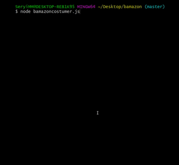

# bamazon

**Creator**: `Sergo Mikirtumov`

**Created on**: `Nov 15th 2019`

## ABOUT THE APP
`Bamazon` is a command line node app that takes in orders from customers and depletes stock from the store's inventory.

## HOW TO USE LIRI

**Screen-shot**

## TECHNOLOGIES USED
* Javascript
* Nodejs
* MySQL
* Node packages:
    * MySQL
    * Inquirer
    * Cli-table
    * Chalk
* Git
* GitHub